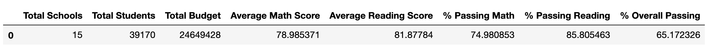

# School_District_Analysis

**How is the district summary affected?**  

Here's the original unaltered data:
  

Here's the data after all 9th grade reading and math scores for Thomas High was purged from our dataset:

As you can see there was a slight drop in all scores but none of the data for total schools, students and budgetary data was affected.

**How is the school summary affected?**  
Looking again at the unaltered data, Thomas High was in the top 5 schools for both reading and math scores. Once we recalculate with the updated values, Thomas Highs ranking for reading scores stays the same but for math it drops out of the top 5 schools and is bested by Griffin High School. 

How does replacing the ninth graders’ math and reading scores affect Thomas High School’s performance, relative to the other schools?
Recalculate the scores by grade, scores by school spending, scores by school size, and scores by school type.  

**How does replacing the ninth-grade scores affect the following?**
* Math and Reading Scores by Grade  

    * Scores for 9th grade show NaN now since we purged the values  

* Scores by School Spending

  * Passing Math, Reading and Overall Passing decline for the $630-644 ranges  
* Scores by School Size

    * Passing Math, Reading and Overall Passing scores decline in the medium size school ranges
* Scores by School Type

    * Interestingly enough, the Average Math and Reading Scores for charter schools remains unchanged but the percentage of Passing Math, Reading and Overall passing declines.